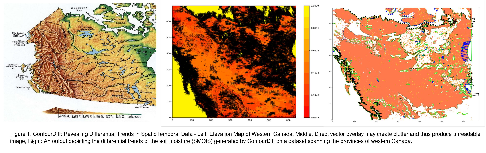
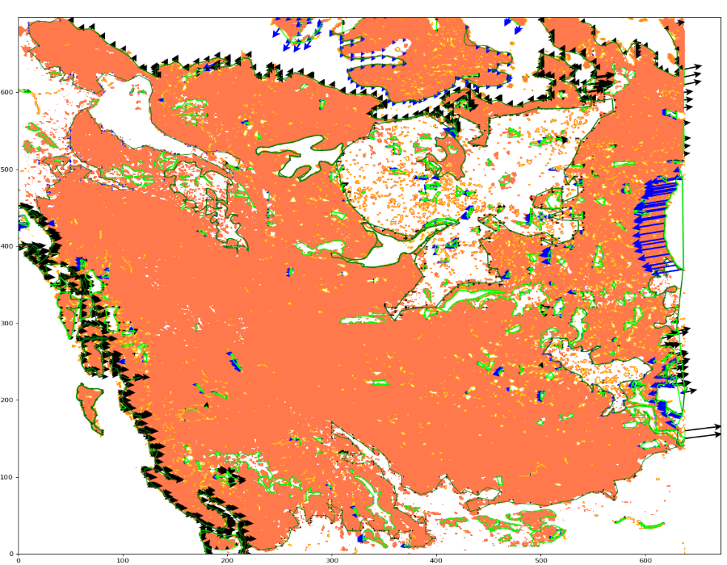
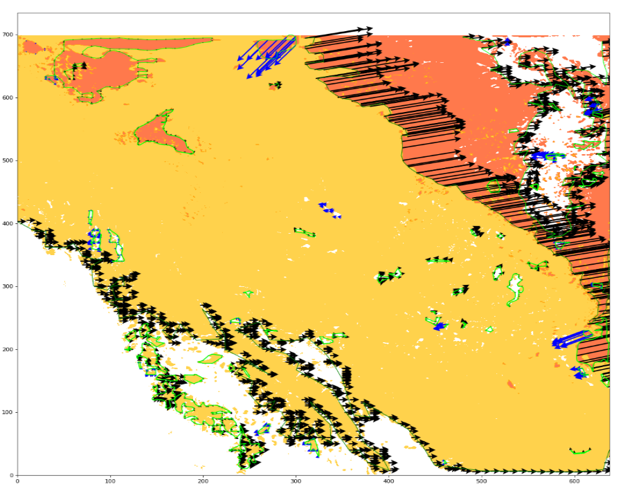
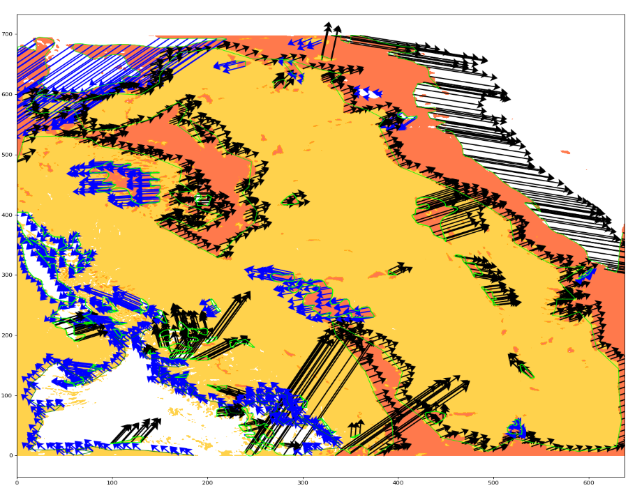

# ContourDiff
ContourDiff is a vector-based visualization over contour plots to analyze the trends of change across spatial regions and temporal domain. ContourDiff is written in python 3.7. ContourDiff first, aggregates for each location, the information around the neighbouring points over the temporal domain and then, creates a vector field that extracts the vectors associated to the contour paths. Finally, it overlays the
prominent vectors along the contour paths, revealing the differential trends that the contour lines experienced over time. 

<!-- -->

This readme explains how to set-up and use this code as well as the Dataset Description and input data format.

# Dataset Description
Our approach is applicable to any spatiotemporal dataset, which is spatially continuous. The data can be represented as positive matrices, each corresponding to a single time sample.
In this paper, we have used Weather Research and Forecasting (WRF) model output as a case study. WRF has been one of most used and steadily growing atmospheric model for research and numerical weather prediction with over 36,000 registered users and over 1,340 peer reviewed publications. The observed dataset contains data values related to 26 parameters from January 2013 to September 2015 over western Canada (latitude X longitude). As a case study for this research, we examine the following parameters: soil moisture (SMOIS), land surface temperature (TSK), and downward long wave flux at ground surface (GLW) using March 2013, March 2014 and March 2015 dataset to show trends. The dataset for each month used for this work has the size 639 X 699 with a resolution of 4km. Each dataset for a month has 446,662 rows and 29 columns. 

# Input Data Format
This code can take any number of input files (more than 1). For example, we want to show the change of trend in 3 years of data. So, we are taking three files of March 2013, March 2014 and March 2015. We suggest you unzip Datasets.zip and put it in the same directory. The input files are in .csv format that holds values for different parameters in the whole temporal region. In Column D, M and AC, we find the values of Surface Temperature (TSK), Ground Long Wave (GLW), Surface Moisture (SMOIS) that we use as example dataset.

# Libraries used for Implementation
1. Pandas - 0.23.4: This module is used to create a dataframe from the input CSV files to do further analysis and computation.
2. Numpy - 1.15.4: This module is used to create 2-dimensional arrays from the dataframe and perform the required computation before       plotting the resultant values as a figure.
3. Matplotlib - 3.0.2: This module is used to display figures from computation performed based on user input.
4. Shapely - 1.6.4: This module is used to create the polygons.
5. Scipy - 1.3.0: This module is used for polygon simplification.

# Running Code and Genreating Images
1. Download the full repository using Git.
2. Run the following command line:

   python App.py -l <input_file_names> -c <column_name>
   
   input_file_names: names of the .csv input files need to be inserted. For example, in the repository, we have included three .csv        files named '2013-03-01.csv', '2014-03-01.csv', '2015-03-01.csv' to show the trends of change for 3 years. 
   
   column_name: There are 26 parameters in 26 columns in each .csv file included. So, name of one parameter needs to be inserted to        visualize the trend of that geospatial variable.
   
   Example: python App.py -l 2013-03-01.csv 2014-03-01.csv 2015-03-01.csv -c SMOIS
3. Code Description: 

   App.py: This is the main application that takes command from the users and calls other two files.
   
   Data.py: This portion of the code processes all the data to get it ready for visualization.
   
   GenerateImages.py: This portion visualizes trends for the data on top of a contourmap.

# Output for different variables:
SMOIS data provides the following output:
<!-- -->
TSK data provides the following output:
<!-- -->
GLW data provides the following output:
<!-- -->

# Submitted Paper:
A short paper on this work has already been submitted in VIS 2019 titled "ContourDiff: Revealing Trends in SpatioTemporal Data". 
